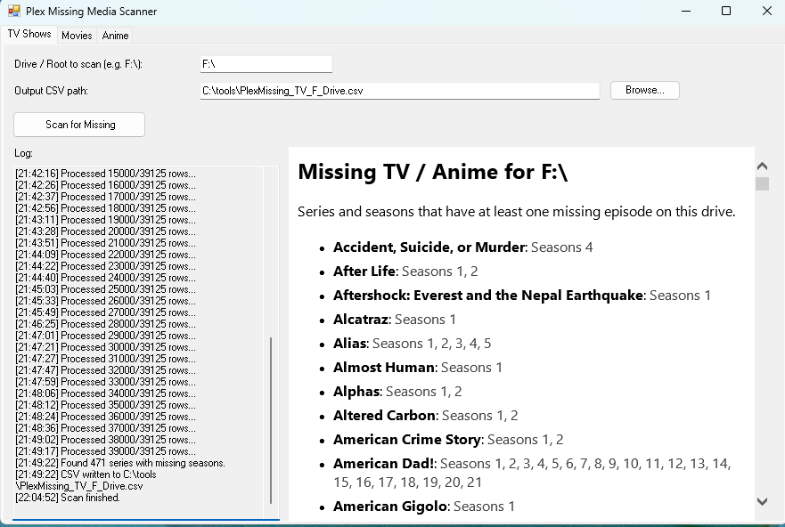
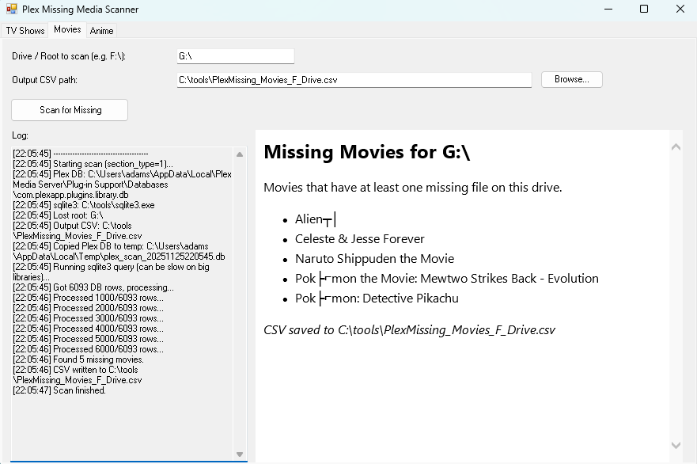
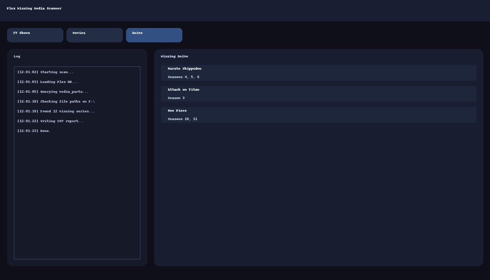

# Plex Missing Media Scanner


A Windows PowerShell GUI tool that scans your Plex database and tells you **which TV shows, movies, and anime are missing** from a given drive (e.g. after a disk failure, format, or path change).

Instead of clicking through every season and episode in Plex, this tool generates a **clean summary** and **CSV report** you can use as a reacquisition checklist.

---

## ✨ Features

- 🖥 **Tabbed GUI** – Separate tabs for **TV Shows**, **Movies**, and **Anime**
- 📂 **Per-drive scanning** – Point it at a missing drive (e.g. `F:\`) and it finds what used to live there
- 📚 **Plex-aware** – Reads directly from the Plex SQLite database
- 📋 **Series-level summary** – For TV/Anime it shows:
  - `Family Guy – Seasons 1, 2, 3, 4, 5 missing`
  - Instead of a huge list of every individual episode
- 🎬 **Movies tab** – Lists movie titles that are missing from that drive
- 📄 **CSV export** – Easy-to-filter report for rebuilding your library
- 🔒 **Read-only** – The script only reads Plex’s DB and your file system. It does **not** modify anything.

---

## 🖼 Screenshots

### TV Shows Tab



### Movies Tab



### Anime Tab



---

## 📦 Requirements

- Windows 10/11  
- PowerShell 5+ (built-in on modern Windows)  
- Plex Media Server installed on the same machine **or** its database available locally  
- `sqlite3.exe` (bundled with the tool or placed manually)

The script expects:

- Plex database at:  
  `%LOCALAPPDATA%\Plex Media Server\Plug-in Support\Databases\com.plexapp.plugins.library.db`
- SQLite at:  
  `C:\tools\sqlite3.exe`

You can change these paths in the script if your setup is different.

---

## 🚀 Getting Started

1. **Download the files** from this repository:
   - `PlexMissingMedia_GUI_Tabs.ps1` *(or the compiled `.exe` if provided)*
   - `sqlite3.exe` (if not already installed)
2. Place them in a folder, for example:
   ```text
   C:\tools\
       PlexMissingMedia_GUI_Tabs.ps1
       sqlite3.exe
   ```
3. (Optional, once) Allow local scripts to run:
   ```powershell
   Set-ExecutionPolicy RemoteSigned -Scope CurrentUser
   ```
4. Run the GUI:
   ```powershell
   powershell -ExecutionPolicy Bypass -File "C:\tools\PlexMissingMedia_GUI_Tabs.ps1"
   ```

---

## 🧭 How to Use the GUI

1. Open the tool – you’ll see three tabs:
   - **TV Shows**
   - **Movies**
   - **Anime**
2. On each tab:
   - Set the **drive/root** you lost, e.g.:
     - `F:\`
     - `F:\Anime\` (for the Anime tab if your anime is in a subfolder)
   - Choose an **output CSV path** (e.g. `C:\tools\PlexMissing_TV_F_Drive.csv`)
   - Click **“Scan for Missing”**
3. The left-hand **log panel** shows what’s happening:
   - Loading DB
   - Querying Plex
   - Checking files
   - Writing CSV
4. The right-hand **summary panel** shows a human-readable list:
   - TV/Anime: series + seasons missing
   - Movies: titles that no longer exist on disk
5. Open the CSV in Excel, LibreOffice, or any spreadsheet tool – that’s your **reacquire list**.

---

## 📂 Example Output

### TV / Anime CSV

Columns:

- `SeriesTitle`
- `SeasonsMissing`
- `LostRoot`

Example row:

```text
Family Guy,1,2,3,4,5,F:\
```

### Movies CSV

Columns:

- `MovieTitle`
- `LostRoot`

Example row:

```text
Inception,F:\
```

---

## 🔧 Customisation

You can tweak the script to:

- Change default drive (e.g. `G:\` instead of `F:\`)
- Change default output paths (e.g. save reports somewhere else)
- Adjust Plex DB or SQLite locations
- Integrate into your own launcher or toolchain

---

## ⚠️ Safety

- The script operates in **read-only** mode on the Plex DB (it copies the database to a temp file before querying).
- It does **not** modify:
  - Your Plex configuration
  - Your Plex library
  - Any media files

That makes it safe to run even on a production Plex server.

---

## ❤️ Why This Exists

Losing a drive sucks. Rebuilding your Plex library shouldn’t.

This tool gives you a clear list of what went missing so you can focus on **reacquiring shows and movies**, not endlessly clicking through the Plex UI.

If you find it useful, consider:

- Opening an issue with feature requests  
- Submitting a PR with improvements  
- Sharing it with others who run Plex 😄
